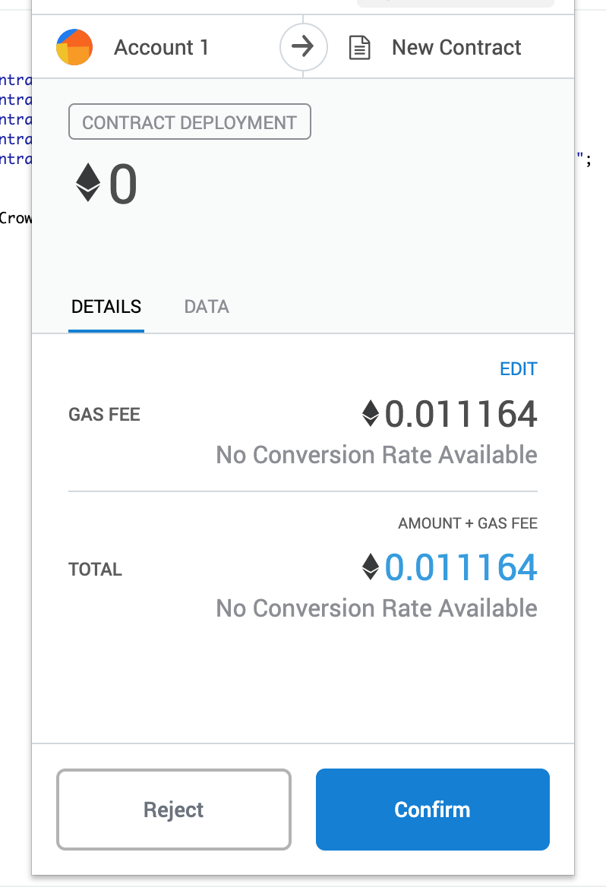
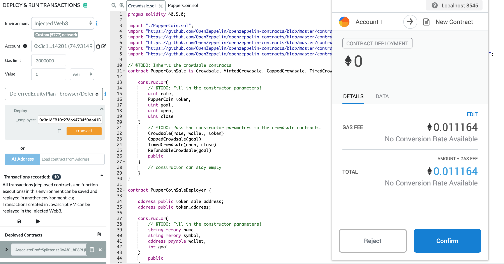
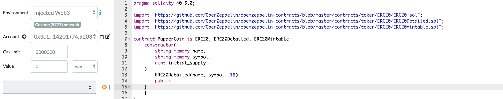
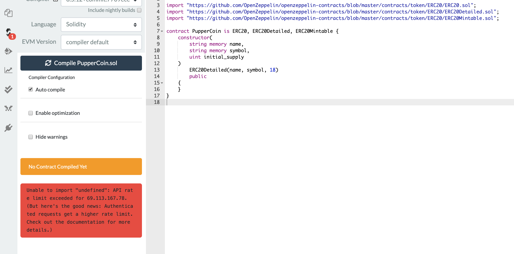

# Advance_Solidity

There are two starter codes in this home:

1. Crowdsale.sol
2. PupperCoin.sol

We need to be connected to the test network and MetaMask first. Then, the contracts need to be deployed to the Injected Web3 environment. 

### Contract_1:

### Contract_2:

At the end, I was not able to compile the second cntract because I run into some issues related to the rate limite that had exceeded already. 

